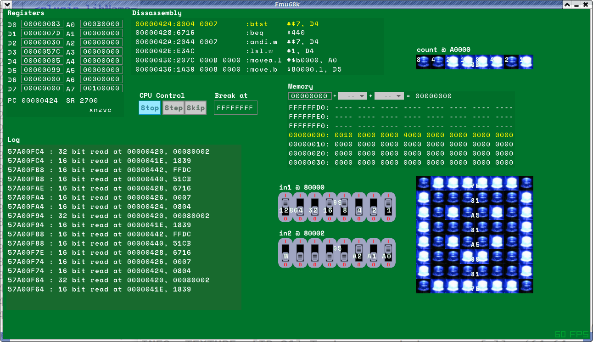

# Emu68k simulated 68000 system with device plugins

## About

Emu68k is a simple program to allow a 68000 system to be simulated.  Different systems can be created by specifying which devices (plugins) are included, an assembler is also integrated to allow experimentation and learning (and enjoyment!) of 68000 assembly language.

It is mainly intended as a tool to help with my experiments with a 68008 and too many breadboards! I can code anywhere with an edit/make/run cycle and later test it assuming my hardware lash ups behave the same way as various device plugins!

Its still early days and there is lots to do! [I'd welcome ideas and contributions, and relevant chat about hardware implementation.](http://bedroomcoders.co.uk/captcha/)

#### file structure
	target/asm			68k assembly language files
	target/machines		machine specification files
	plugins				plugin library binaries
	obj					build objects
	readme.md			this file
	src					C source code
	src/plugins			C source for plugins
	screenies			screen shots
	plug-src			C source code for plugins
	Makefile		
	include				include sources
	resources			runtime resources (textures etc) for emu68k and plugins
	support/Musashi		68k simulation library
	support/srec		srecord files utility
	support/a68k		68k assembler

## Building

There is a provided Makefile, however there are two support utilities (support/a68k/A68k and support/srec/srec2bin) in the support directory that need to be compiled (just run make) before the Makefile for Emu68k will work 

Additionally you will need to get and compile [raylib](http://raylib.com ) (github recommended) 

The Makefile is expecting raylib to be at the same directory level that emu68k is:

	./devel/emu68k/
	./devel/raylib/

usually building raylib is simply a case of entering raylib/src and running make.

**Note** that Musashi is now a submodule, you might need to do:

	git submodule update --init --recursive

There is no need to build and run the op code generator as that is done automagically if needed, if you need to change the settings there is a separate config file include/m68kconf-emu68k.h, the Musashi sources are directly included with the build.

## Building 68k ASM source

if you place a new .asm file in the asm-src directory the next time you run make it will be automagically picked up and providing there are no errors in your assembly code, then you should have a corresponding .bin file you can load into the simulator.

Binary files are assumed to start at 0x0 (vector table!) and be a single continuous block of memory, in future srecord files are likely to be used, hopefully allowing different sections.

## Running Emu68k

emu68k is invoked from the command line and requires two parameters

	./emu68k machines/machine1.xml asm-src/machine1test1.bin

the first parameter is the machine specification file, the latter being the binary file to load into "ram", its a good idea to specify in the file name for a binary, which machine specification file it requires.

Looking at the screenshot above you can see a list of all the data and address register values, to the right of that you can see a disassembly of the code at the PC.

below the register view is an indication of recent memory activity.

The remainder of the items on the screen are provided by plugin instances.

Pressing the space bar will single step the 68000. It also serves to halt a run. If you want to skip an instruction press s. You can set the system running by pressing the r key, every 60th of a second it will execute 100,000 instructions then update the UI.  When running with a suitable binary can result in such extravaganzas as the 8x8x1 sprite editor as seen in the above screen shot and this [short video](https://youtu.be/pJ5as4MCeCk).

 	

## Machine specification files

The configuration file describes a collection of plugin instances.

The following tags are recognized:

**\<machine\>**
This tag encapsulates a collection of plugin instances, it has a "name" attribute that is currently unused. Potentially this could include theme information, screen resolution and other global properties such as CPU type.

**\<plugin\>** describes an instance of a plugin

* **libName attribute** specifies which library to use for the plugin for example "simpleOut" will use libsimpleOut.so NB this is case sensitive on reasonable OS's and **MUST** be the first attribute.
* **label attribute** This text is printed next to the plugin instance
* **x & y attributes** together specify the screen coordinates to place the instance
* **addressStart** specifies the start of the address range that the plugin instance is mapped to, this must be specified in hexadecimal (0x)

**\<properties\>**
(optional) only valid inside a plugin tag - specifies a custom property setting for a plugin instance

* **name attribute** The name of a property for example to label the 5th bit of a simpleIn plugin specify "d4" or "D4"
* **value attribute** The value setting for this property

## Writing plugins

Now UI controls to do with the actual running of the 68000 are all provided by plugins, this means things are really flexible, for example if you want to follow the stack and also say some variables, just add two memView plugins point one at your variables and set A7 in the Ax offset selector...

First read the source for what few plugins there are! more to come, contributions welcome! One potential cause for confusion is the distinction between a plugin and a plugin instance.  A plugin represents the actual library and a collection of properties global to all plugin instances of that plugin.  A plugin instance is what actually provides properties that are specific to that instance of the plugin in such as position and internal state.

#### Plugin API

This may change! Its still early days, you have a lot of power, when writing device plugins you shouldn't "cheat" for example until there is a mechanism for devices to gain control over the bus from the 68000, then devices should only be able to look inside their own memory range...

**void initialise(void\* pInst)** used to to set stuff up call whenever an instance is created. See the plugin source to see the things that you need to do like set up the plugins render texture, allocate its variables area etc 

**int getAddressSize()** This defines the size of the memory block that the plugin is mapped to.

**byte getAddress(void\* pInst, int address)** this is called when a memory read is done by the processor in the plugins mapped range.

**void setAddress(void\* pInst, int address, byte data)** called when a memory write happens inside the mapped memory range

possibly deprecated **void clicked(void\* pInst, int x, int y)** if the user clicks on the plugins area this is called with the screen coordinates. this was created before I started using RayGui for the UI...

**void draw(void\* pInst)** the plugin instance is drawn on its own render texture, this is a good place to also update anything that needs to be updated continuously.

**void setProperty(void\* inst, const char\* prop, void\* value)** this is used to set properties specific to a plugin type, it could be bit labels or potentially more unique settings.

**void setBreakPoint(unsigned int bp)** sets the address the emulation with break at

**void setRunning(bool run)** starts the emulation running

**void doStep()** single step the emulation

**void doSkip()** skip the PC onto the next instruction

**bool isRunning()** is the emulation currently running

**void make_hex(char* buff, byte* mem, unsigned int pc, unsigned int max, unsigned int length)** a convenience function makes an ascii string from emulation memory contents

**TODO** lots but there should be an api to get/set properties pertain to the emulation for example
 
    ptr = getEmuProperty(EMU86K_LOG_ADDRESS);
    

others might include EMU86K\_RUN set with enum to step run stop, can be read EMU86K\_BREAKPOINT to set the machines breakpoint